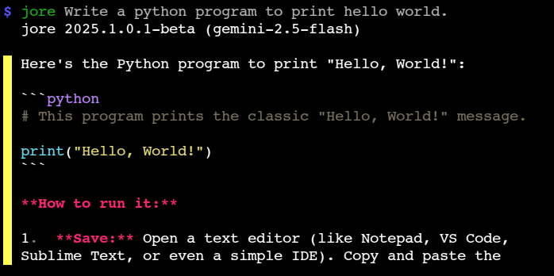

# Jore

**jore** (**yes, me!**) is a simple command-line AI assistant powered by Google Gemini.

**Why named after me?**
Why Not!

## Demo



## Installation

Follow these steps to install **jore** on your system.

1. **Download** the script:
   ```bash
   curl -LO https://raw.githubusercontent.com/jorexdeveloper/jore/main/jore
   ```
2. **Make it executable**:
   ```bash
   chmod +x jore
   ```
3. **Move** it into your `PATH`:
   ```bash
   sudo mv jore /usr/local/bin/
   ```

### Requirements

- Bash 4+
- curl
- jq
- fmt
- bat (for pretty output)
- less (for paging support)
- xclip or xsel (for clipboard support)

## Configuration

Configure **jore** to work with your Google Gemini API key and preferences.

### API Key

Set your Gemini API key via environment variable or file.

- **Get free API key [here](https://aistudio.google.com/app/api-keys)**

- **Environment Variable**:
  ```bash
  export GEMINI_API_KEY="your_api_key_here"
  ```
- **Key File** (`~/.gemini.key`):
  ```bash
  echo "your_api_key_here" > ~/.gemini.key
  ```

### Preferences

- **Chat History**
  Stored at `~/.local/share/jore/history/chat.json` by default.
- **Response Saving**
  Saved at `~/.local/share/jore/responses/` when enabled.
- **Log Level**
  Adjust verbosity with `-L` (0–5).

## Usage

Invoke **jore** with options and an optional prompt.

```bash
jore [OPTIONS] [PROMPT]
```

### 🌐 Global Options

| Flag      | Description                                       |
| --------- | ------------------------------------------------- |
| `-m NAME` | Set the API model (e.g., `gemini-2.5-flash`).     |
| `-i`      | Force interactive mode.                           |
| `-c`      | Print current chat history.                       |
| `-n`      | Backup and start a new chat.                      |
| `-N`      | Start new chat without backup.                    |
| `-p`      | Private chat (disable history & response saving). |
| `-d`      | Disable chat history.                             |
| `-s`      | Show separator between messages.                  |
| `-r`      | Prefer raw output (no pretty printing).           |
| `-R`      | Prefer raw input (disable slash commands).        |
| `-j`      | JSON output (implies raw output).                 |
| `-q`      | Quiet mode (suppress startup messages).           |
| `-Q`      | Quiet + raw output.                               |
| `-l`      | List supported API models.                        |
| `-L INT`  | Set log level (0=NONE to 5=DEBUG).                |
| `-v`      | Print version and exit.                           |
| `-h`      | Print help and exit.                              |

### Interactive Mode

Launch a REPL chat session. Omit a prompt or use `-i` to force interactive mode.

```bash
jore
```

Key commands in session:

- `/help` – Show available commands.
- `/model NAME` – Switch API model.
- `/raw` – Toggle raw output mode.
- `/clear` – Clear current chat.
- `/list` – List supported models.
- `/exit` – End the session.

### Non-Interactive Mode

Send a single prompt and exit.

```bash
jore "Explain quantum computing in simple terms."
```

Combine with flags:

```bash
jore -j -m gemini-2.5-flash "Generate a meal plan for a vegetarian."
```

## Chat History & Responses

Manage conversation logs and responses with ease.

- **View History**
  ```bash
  jore -c
  ```
- **New Chat with Backup**
  ```bash
  jore -n
  ```
- **New Chat without Backup**
  ```bash
  jore -N
  ```

## Listing Supported Models

Fetch and display models supported for generation.

```bash
jore -l
```

Add `-j` for a JSON list or use `-ll` to print simple model list.

## Common Use Cases

- Quick fact queries
- Multi-turn AI conversations
- Scripted API calls in shell pipelines
- Generating formatted reports or code snippets

## License

**jore** is licensed under **GPL v3+**.
© 2025 Jore – [GitHub/jorexdeveloper/gemini-cli](https://github.com/jorexdeveloper/gemini-cli)
